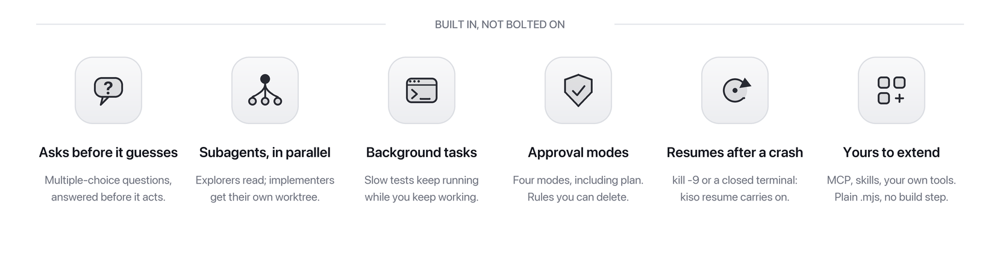
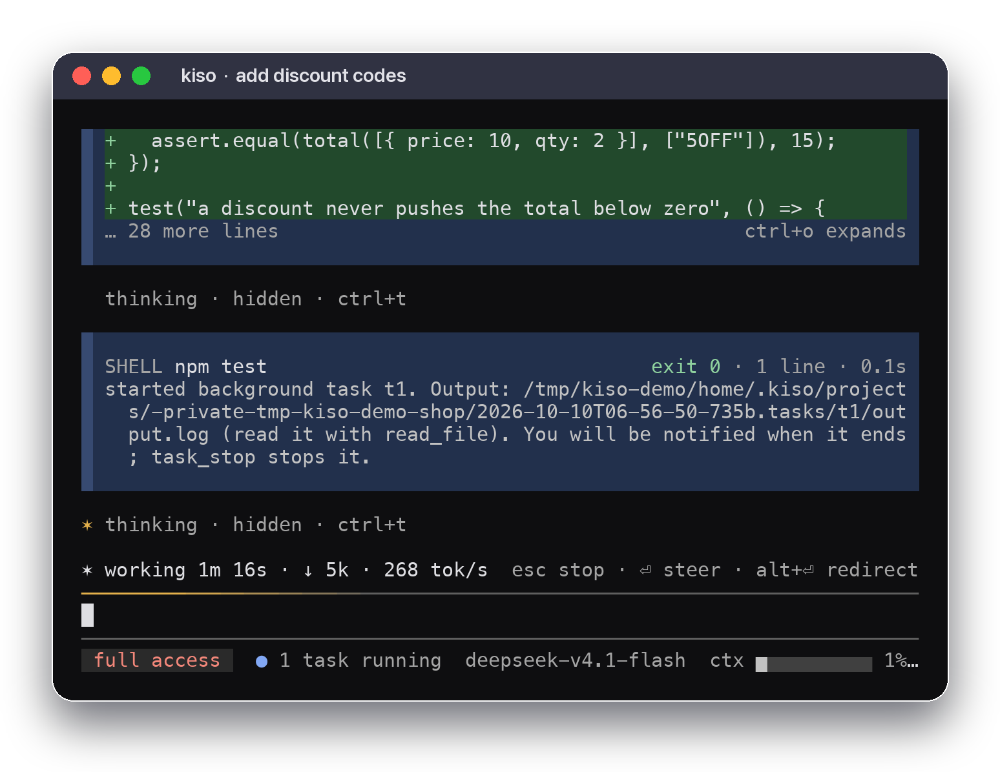

<h1 align="center"><picture><source media="(prefers-color-scheme: dark)" srcset="assets/readme/lockup-dark.png"></picture></h1>

<p align="center"><b>kiso is a durable agent runtime with a kernel capped at 2,200 lines,<br>and a coding agent for your terminal built on it.</b></p>

<p align="center">
  <a href="https://www.npmjs.com/package/@vincemakes/kiso-code"></a>
  <a href="https://github.com/vincemakes/kiso/actions/workflows/ci.yml"></a>
  
</p>

<p align="center"><b>v0.49.0</b> · Node ≥ 22 · <a href="https://kiso.work">kiso.work</a> · <a href="README.zh.md">简体中文</a></p>

<p align="center"><picture><source media="(prefers-color-scheme: dark)" srcset="assets/readme/features-dark.png"></picture></p>

<p align="center"></p>

## Install

```bash
npm install -g @vincemakes/kiso-code
kiso
```

Node ≥ 22 on macOS or Linux. Or run it without installing: `npx @vincemakes/kiso-code`. The first run needs no key: kiso plays a scripted demo turn, so you see the shape before anything is spent, then asks you to connect a model.

```bash
kiso login deepseek      # or anthropic / openai / zai
kiso login chatgpt       # a ChatGPT subscription: a browser sign-in, no key
kiso login --endpoint https://gateway.example/v1   # a gateway: its key, sent to it alone
```

Keys never go in the config file. Profiles, effort levels, context windows and every other option: [docs/configuration.md](docs/configuration.md).

## Under the hood

- **It picks up where it left off.** After a crash, a `kill -9` or a closed terminal, `kiso resume` continues from the durable committed prefix: generation still streaming when it died is regenerated, and a side effect whose outcome is unknown goes to a human rather than being repeated.
- **Long tasks don't overflow.** Past half the window, kiso compacts at the end of a phase, and each new summary replaces the last instead of piling up.
- **Any model you have.** DeepSeek, Claude, GPT, a ChatGPT subscription, and any OpenAI-compatible endpoint or gateway.
- **You can see where it goes.** Each turn ends with its fresh input, output and cache hits; `/context` shows what fills the context.
- **Small and inspectable.** The kernel is capped at 2,200 lines (2,194 of 2,200 today); a session is a JSONL log you can read; every design decision is one of 46 ADRs, with why, and when to overturn it.

Keys, commands and the status row: [docs/cli.md](docs/cli.md). `?` shows the keys in a session and `/help` lists the commands. `ctrl+v` attaches the clipboard image on macOS; elsewhere, put the image's path in your message.

## Approval modes

`/mode` or `shift+tab` switches; the status row always names the mode.

| mode | does |
|---|---|
| `default` | reads and read-only shell run; writes, edits and other shell ask |
| `accept-edits` | `default`, and edits run too (except into `.git/` or `.kiso/`) |
| `plan` | reads only; everything else is refused |
| `full-access` | everything runs without asking — a user deny and the floor still hold |

A mode is one voice in a `deny > allow > ask` chain, so a saved "don't ask again" rule still allows under any mode: switching modes is not a revocation. The rules live in `~/.kiso/extensions/dont-ask-again.mjs`; delete one to be asked again. In every mode, full access included, a destructive command aimed at what cannot be recovered — `/`, your home directory, the workspace root, its `.git`, `~/.ssh` and the like — is refused. The full rules: [docs/cli.md](docs/cli.md).

## Extensions

An extension is a plain `.mjs` file — no build step. Five ship built in: MCP, skills, subagents, ask and task. Writing your own: [docs/extensions.md](docs/extensions.md).

**Which children are stripped.** The two a model can cause to run — the shell tool and an MCP server started over stdio — lose provider credentials: the known key variables, anything ending `_API_KEY` or `_AUTH_TOKEN`, and every variable a profile names in `apiKeyEnv`. NOT stripped: a subagent's child (it is kiso itself and must reach the model) and the programs you start yourself (`$EDITOR`, the sign-in browser, `kiso update`), which inherit your environment.

## Using it

The agent is built on `@vincemakes/kiso-runtime`: a durable, append-only session store, an agent factory and a typed event stream.

```ts
import { defineTool } from "@vincemakes/kiso-core";
import { createAgent, SessionStore } from "@vincemakes/kiso-runtime";
import { createAnthropicAdapter } from "@vincemakes/kiso-provider-anthropic";
import Anthropic from "@anthropic-ai/sdk";

const agent = createAgent({
  model: "claude-sonnet-5",
  tools: [
    defineTool({
      name: "add",
      description: "Add two numbers",
      parameters: { type: "object", properties: { a: { type: "number" }, b: { type: "number" } }, required: ["a", "b"], additionalProperties: false },
      execute: async ({ a, b }) => ({ content: String(a + b), isError: false }),
    }),
  ],
  store: new SessionStore("./sessions"),          // append-only JSONL
  adapter: createAnthropicAdapter(new Anthropic()),
});

const session = await agent.session({ id: "demo" });
for await (const ev of session.run("What is 2+3?")) {
  switch (ev.type) {
    case "text_delta": process.stdout.write(ev.text); break;
    case "terminal": console.log("\n", ev.outcome.kind); break;
  }
}
```

Getting started with the SDK: [docs/getting-started.md](docs/getting-started.md).

## Documentation

| | |
|---|---|
| Start | [cli-quickstart.md](docs/cli-quickstart.md) · [getting-started.md](docs/getting-started.md) |
| Reference | [cli.md](docs/cli.md) · [configuration.md](docs/configuration.md) · [extensions.md](docs/extensions.md) · [sdk.md](docs/sdk.md) |
| Design | [durability.md](docs/durability.md) · [context.md](docs/context.md) · [architecture.md](docs/architecture.md) · [kernel-rule.md](docs/kernel-rule.md) · [ADRs](docs/adrs/README.md) |
| Status | [status.md](docs/status.md) · [bench/README.md](bench/README.md) |

## License

MIT
