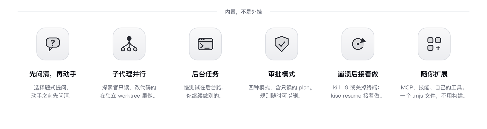

<h1 align="center"><picture><source media="(prefers-color-scheme: dark)" srcset="assets/readme/lockup-dark.png"></picture></h1>

<p align="center"><b>kiso 是一个持久的 agent 运行时，内核上限 2,200 行；<br>它之上还有一个跑在终端里的编程助手。</b></p>

<p align="center">
  <a href="https://www.npmjs.com/package/@vincemakes/kiso-code"></a>
  <a href="https://github.com/vincemakes/kiso/actions/workflows/ci.yml"></a>
  
</p>

<p align="center"><b>v0.49.0</b> · Node ≥ 22 · <a href="https://kiso.work">kiso.work</a> · <a href="README.md">English</a></p>

<p align="center"><picture><source media="(prefers-color-scheme: dark)" srcset="assets/readme/features-zh-dark.png"></picture></p>

<p align="center"></p>

## 安装

```bash
npm install -g @vincemakes/kiso-code
kiso
```

需要 Node ≥ 22，支持 macOS 和 Linux。不想安装可以直接 `npx @vincemakes/kiso-code`。第一次运行不需要密钥：kiso 会先用内置脚本演示一轮完整流程，不花一分钱，然后提示你接入模型。

```bash
kiso login deepseek      # 也可以是 anthropic / openai / zai
kiso login chatgpt       # ChatGPT 订阅：浏览器登录，不需要密钥
kiso login --endpoint https://gateway.example/v1   # 网关：密钥只发给这个网关
```

密钥从不写进配置文件。模型档、思考档位、上下文窗口等全部选项见 [docs/configuration.md](docs/configuration.md)。

## 它怎么做到的

- **断了能接着做。** 进程崩溃、`kill -9`、关掉终端之后，`kiso resume` 从已提交的持久前缀继续：中断时还没生成完的内容会重新生成，结果不确定的操作交给人决定，绝不自动重做。
- **长任务不爆上下文。** 用到窗口一半时，kiso 在一个阶段结束后自动压缩，新摘要替换旧摘要，不会越压越多。
- **哪家的模型都能接。** DeepSeek、Claude、GPT、ChatGPT 订阅，以及任何 OpenAI 兼容的端点和网关。
- **花在哪里一目了然。** 每轮结束显示这一轮的新输入、输出和缓存命中；`/context` 看上下文被什么占着。
- **小而透明。** 内核上限 2,200 行（现在 2,194 行）；会话就是一份可以直接读的 JSONL 日志；每个设计决定都记在 46 份 ADR 里，写明为什么这样做、什么情况下该推翻它。

按键、命令和状态栏的完整说明见 [docs/cli.md](docs/cli.md)。会话里按 `?` 看按键，`/help` 看命令。`ctrl+v` 贴剪贴板里的图片（仅 macOS；其他系统请在消息里写上图片的路径）。

## 审批模式

`/mode` 或 `shift+tab` 切换，状态栏始终显示当前模式。

| 模式 | 行为 |
|---|---|
| `default` | 读文件和只读命令直接放行；写文件、改文件、其他命令先问你 |
| `accept-edits` | 在 `default` 基础上，改文件也直接放行（`.git/`、`.kiso/` 除外） |
| `plan` | 只能读，其他一律拒绝 |
| `full-access` | 全部放行，不再询问；你的拒绝规则和底线照样生效 |

模式只是 `deny > allow > ask` 这条链里的一票：保存过的“不再询问”规则在任何模式下都照样放行，切换模式不会撤销它。这些规则存在 `~/.kiso/extensions/dont-ask-again.mjs`，删掉一条就会重新询问。无论哪种模式，包括 `full-access`，指向删了就无法恢复的位置的破坏性命令都会被拒绝：`/`、你的家目录、工作区根目录、它的 `.git`、`~/.ssh` 这类。完整规则见 [docs/cli.md](docs/cli.md)。

## 扩展

扩展就是一个普通的 `.mjs` 文件，不需要构建。内置了五个：MCP、技能、子代理、提问和任务清单。写自己的扩展见 [docs/extensions.md](docs/extensions.md)。

**哪些子进程会被剥离凭据。** 模型能触发运行的两类：shell 工具，以及用 stdio 启动的 MCP 服务器。它们拿不到模型商的凭据：已知的密钥变量、以 `_API_KEY` 或 `_AUTH_TOKEN` 结尾的变量、以及模型档 `apiKeyEnv` 指定的变量都会被去掉。不剥离的：subagent 的子进程（它就是 kiso 本身，要连模型），以及你自己启动的程序（`$EDITOR`、登录用的浏览器、`kiso update`），它们照常继承你的环境。

## 使用方式

这个助手建在 `@vincemakes/kiso-runtime` 之上：一个持久的、只追加的会话存储，一个 agent 工厂，和一条带类型的事件流。

```ts
import { defineTool } from "@vincemakes/kiso-core";
import { createAgent, SessionStore } from "@vincemakes/kiso-runtime";
import { createAnthropicAdapter } from "@vincemakes/kiso-provider-anthropic";
import Anthropic from "@anthropic-ai/sdk";

const agent = createAgent({
  model: "claude-sonnet-5",
  tools: [
    defineTool({
      name: "add",
      description: "Add two numbers",
      parameters: { type: "object", properties: { a: { type: "number" }, b: { type: "number" } }, required: ["a", "b"], additionalProperties: false },
      execute: async ({ a, b }) => ({ content: String(a + b), isError: false }),
    }),
  ],
  store: new SessionStore("./sessions"),          // append-only JSONL
  adapter: createAnthropicAdapter(new Anthropic()),
});

const session = await agent.session({ id: "demo" });
for await (const ev of session.run("What is 2+3?")) {
  switch (ev.type) {
    case "text_delta": process.stdout.write(ev.text); break;
    case "terminal": console.log("\n", ev.outcome.kind); break;
  }
}
```

SDK 入门见 [docs/getting-started.md](docs/getting-started.md)。

## 文档

| | |
|---|---|
| 上手 | [cli-quickstart.md](docs/cli-quickstart.md) · [getting-started.md](docs/getting-started.md) |
| 参考 | [cli.md](docs/cli.md) · [configuration.md](docs/configuration.md) · [extensions.md](docs/extensions.md) · [sdk.md](docs/sdk.md) |
| 设计 | [durability.md](docs/durability.md) · [context.md](docs/context.md) · [architecture.md](docs/architecture.md) · [kernel-rule.md](docs/kernel-rule.md) · [ADR](docs/adrs/README.md) |
| 现状 | [status.md](docs/status.md) · [bench/README.md](bench/README.md) |

## 许可

MIT
